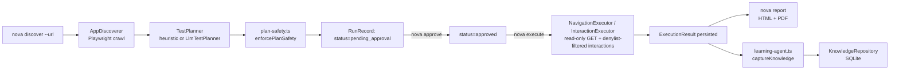
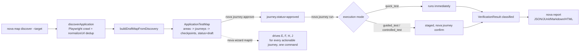

# Nova / TekAssure — Status &amp; Design

_Saved 2026-09-19. Covers project history across sessions plus the design of the codebase as it actually exists on disk in each of the two live checkouts._

## Important: two divergent checkouts exist

This machine has **two separate git repositories** for this product, at different points in its history, and they are **not** the same codebase:

| | `/Users/tharaka/Projects/tekassure` (this directory) | `/Users/tharaka/Projects/nova` |
|---|---|---|
| Remote | `github.com/thaaaru/tekassure` | `github.com/thaaaru/nova` |
| `package.json` name | `@thaaaru/nova` (renamed in place, remote not migrated) | `@thaaaru/nova` |
| HEAD (as of this save) | `d6b7337` "Add LLM-reasoned planning and opt-in, grounded interaction execution" | `66e2036` "Add `nova wizard` — walk a map end to end, nothing to copy or paste" |
| Workflow engine | Plain sequential `HarnessWorkflow` class (LangGraph was tried and **dropped**, see `a4d212d`) | LangGraph state graph (durable workflow controller, current architecture) |
| Test authoring model | AI/LLM-assisted planning (`LlmTestPlanner`, `openai-summarizer.ts`) proposes plans from a discovered app + free-text goal; human approves before execution | **Zero LLM calls anywhere.** Deterministic Application Test Map (areas → journeys → checkpoints), curated once, then run repeatedly |
| Primary artifact | One `RunRecord` per `discover → plan → approve → execute` cycle | Persistent `ApplicationTestMap` with journeys carrying `draft`/`approved`/`deprecated` status, run many times over its lifetime |
| CLI entrypoint | `src/cli.ts` (`nova discover/project/artifact/generate/approve/reject/execute/status/report/knowledge/serve/license`) | `src/cli/index.ts` (`nova init/discover/plan/approve/run/report/map/area/journey/recommendations/wizard/tui/mcp/serve`) |

**This file documents both**, since "status" only makes sense read against real code, not memory. If the intent is to treat one of these as canonical and retire the other, that is a decision to make explicitly — nothing here does that automatically.

---

## Part 1 — Project history (chronological, as tracked across all sessions)

1. **TekAssure defect fixes, licensing, dashboard, rebrand** — original TekAssure product: license activation/verification (`src/licensing/`), a local dashboard/review server (`src/serve/`, `src/review/`), Playwright-based discovery (`src/discovery/playwright-app-discoverer.ts`), heuristic + LLM-assisted planning (`src/planning/`), read-only execution against approved plans (`src/execution/`), Lighthouse audits, a `learning-agent` knowledge base, npm audit hardening, then a rebrand from TekAssure to Nova (brand config now lives in `src/brand.ts`, loaded by `cli.ts`).
2. **v0.1.0 release.**
3. **Architectural reset**: LangGraph was tried, dropped (`a4d212d`, "Drop LangGraph; replace with plain sequential workflow calls" — this codebase, `tekassure`), and later a **second**, different repo (`nova`) was created that reintroduces LangGraph as the durable workflow controller, this time built around a governed, deterministic **Application Test Map** instead of ad-hoc LLM-planned runs, with an explicit **zero-LLM-calls** invariant. That `nova` repo is the one all subsequent feature work (items 4 onward below) happened in.
4. **TUI + HTML reporting overhaul** (nova repo).
5. **Application Test Map feature** (nova repo): areas → journeys → checkpoints, journey `status` lifecycle (`draft`/`approved`/`deprecated`), `quick_test`/`guided_test`/`controlled_test` execution modes with different approval gates.
6. **Run-instructions Q&A** (no code change).
7. **Guided CLI input for missing parameters** (nova repo, `f11af5b`): any command missing a required flag drops into an interactive prompt session instead of erring immediately; `--non-interactive` fails fast listing every missing field at once.
8. **Arrow-key select-list fix** (nova repo, `ecd1866`): raw-mode terminal navigation (`up`/`down`/`enter`/`ctrl+c`) in `src/cli/interactive/prompt-io.ts`.
9. **CLI-hang fix** (nova repo, `d797940`): `close()` now pauses stdin so the process exits after the last guided prompt instead of hanging.
10. **Workflow guidance Q&A** (no code change).
11. **Duplicate-draft-journey fix** (nova repo, `b9b07c5`): root cause was non-normalized URL comparison in `discoverApplication`'s dedup set (`src/services/browser/discover.ts`); trailing-slash/hash variants of the same page produced two `DiscoveredPage` entries with the same title, which then collided into two journeys sharing one derived id. Fixed with a new `normalizeUrl()` plus a defense-in-depth id-collision guard in `buildDraftMapFromDiscovery`.
12. **User escalation → Nova-generated next-commands** (nova repo, `18eb3e9`): after three rounds of the assistant hand-assembling commands (placeholders → verified flags → an assistant-authored bash loop), all rejected, the fix was made a **product feature**: `nova map show`, `nova journey approve`, and `nova journey run`/`journey confirm` now print the exact next `nova ...` invocation themselves, with real ids and `--non-interactive` already filled in — "Next (copy/paste):" — because the operator should never have to assemble a command Nova already has all the information to generate.
13. **`nova wizard <mapId>`** (nova repo, `66e2036`) — the same principle taken one step further per explicit user request ("not even copy paste"): one command walks every draft/approved journey in a map end-to-end — approve → run → confirm (if staged) → generate report — either interactively (prompts default to Yes, so pressing Enter repeatedly drives the whole map) or fully unattended with `--non-interactive`. No command is ever typed or pasted by the operator beyond the initial `nova wizard <mapId>`.

Both features 12 and 13 were verified end-to-end against a real SQLite-backed scratch database seeded from `fixtures/sample-application-test-map.ts` (via `scripts/demo-application-test-map.sh`'s scaffolding pattern), not mocked. Test count in the `nova` repo stood at 239/239 passing after feature 13, all CI runs green.

---

## Part 2 — Design: `tekassure` repo (this directory, HEAD `d6b7337`)

### Pipeline

### Key modules
- **`src/domain.ts`** — core Zod schemas: `HarnessRunInput`, `RunRecord`, `RunStatus`, `AppSnapshot`/`PageSnapshot`, `TestPlan`, `ExecutionResult`, `ApprovalDecision`, `NavigationCheck`/`InteractionCheck`.
- **`src/workflow/harness-workflow.ts`** — `HarnessWorkflow` class; plain sequential method calls (`discover()`, `plan()`, `execute()`) — no state-machine library. Injects `AppDiscoverer`, `NavigationExecutor`, `InteractionExecutor`, `TestPlanner`, `KnowledgeRepository`, `RunRepository` as constructor dependencies.
- **`src/planning/`** — `heuristic-planner.ts` (deterministic, rule-based `TestPlanner`) and `llm-test-planner.ts` (LLM-backed alternative implementing the same interface); `plan-safety.ts`/`action-safety.ts` enforce a denylist before any plan is allowed to execute (e.g. blocks form submission, destructive actions).
- **`src/execution/`** — `public-navigation-executor.ts` (read-only GET navigation/assertions) and `interaction-executor.ts` (opt-in, denylist-filtered click/fill/select against discovered controls only — gated behind `--allow-interactions` and still requires human approval first).
- **`src/discovery/playwright-app-discoverer.ts`** — crawls an app to build an `AppSnapshot` (pages, forms, controls) that grounds both planning and interaction execution.
- **`src/storage/`** — three SQLite-backed repositories: `run-repository.ts` (runs/plans/results), `project-repository.ts` (reusable named projects + Markdown requirement artifacts), `knowledge-repository.ts` (captured domain knowledge/failures/solutions).
- **`src/knowledge/`** — `learning-agent.ts` captures knowledge after each run; `openai-summarizer.ts` is an LLM call that summarizes a run into a knowledge entry (this repo does call an LLM, unlike the `nova` repo's zero-LLM invariant).
- **`src/licensing/`** — `activate.ts`/`verify-license.ts`, JOSE-signed license keys checked before privileged commands run.
- **`src/serve/`** + **`src/review/`** — a local dashboard/review HTTP server (`dashboard-server.ts`, `review-server.ts`) for browser-based discover/approve/execute/report instead of the CLI.
- **`src/reporting/report.ts`** — branded HTML + PDF report generation per run.
- **`src/cli.ts`** — Commander entrypoint; command groups: `license`, `discover`, `project` (create/list/show), `artifact` (add/list/show), `generate` (test cases from requirement artifacts), `approve`/`reject`/`execute`, `install-browser`, `login` (captures a Playwright storage state for authenticated scans), `status`, `report`, `knowledge` (list/search/show), `serve`.

### Governance mechanics in this repo
- Every plan passes through `enforcePlanSafety`/`action-safety.ts` before execution — a denylist, not an LLM judgment call.
- Execution defaults to read-only GET navigation; interactive actions are strictly opt-in (`--allow-interactions`) and grounded only against controls the discoverer actually found on the page.
- A run cannot execute without an explicit `approve` step recording an approver name/note; `reject` is the equivalent negative path.
- Licensing gates command execution via `withLicenseErrorHandling`.

---

## Part 3 — Design: `nova` repo (`/Users/tharaka/Projects/nova`, HEAD `66e2036`)

### Pipeline

### Key modules
- **`src/domain/schemas/test-map.ts`** — `ApplicationTestMapSchema` (`status: draft|accepted`), `UserJourney` (`status: draft|approved|deprecated`, `requiredPersonaIds`, `requiredFixtureIds`, execution mode, checkpoints with risk levels).
- **`src/services/testmap/map-service.ts`** — the **sole business-logic entrypoint** for map/journey operations: `discoverMap`, `listMaps`/`getMap`/`listAreas`/`listJourneys`, `approveJourney`, `runJourney` → `startJourneyRun` (in `journey-run-service.ts`), `confirmRun` → `confirmJourneyRun`, `listPersonas`, `recommendRegressionJourneys`. No function here writes to stdout — that invariant is enforced by convention across the codebase.
- **`src/services/browser/discover.ts`** — Playwright crawl; `normalizeUrl()` (strips hash, trims non-root trailing slash) applied at both queue-seed and link-enqueue points to prevent the duplicate-journey bug fixed in `b9b07c5`.
- **`src/services/testmap/discovery-to-map.ts`** — `buildDraftMapFromDiscovery`, with a defense-in-depth `existingIds` id-collision guard per area.
- **`src/services/testmap/journey-run-service.ts`** — `startJourneyRun`/`confirmJourneyRun`; `quick_test` executes and records immediately, `guided_test`/`controlled_test` stage a `PreparedJourneyRun` (`awaiting_approval`) requiring an explicit `nova journey confirm --reviewer <name>`.
- **`src/cli/interactive/`** — the guided-input subsystem: `prompt-io.ts` (raw-mode arrow-key `select`, line `line`, `confirm`, all built on `createPromptSession`), `resolve-inputs.ts` (`resolveInputs`/`FieldSpec`/`ResolveInputsConfig` — declaratively resolves each command's required fields, prompting only for what's actually missing, throwing immediately in `--non-interactive` mode with every missing field listed at once), `interactivity.ts` (`detectInteractivity`, TTY detection), and one `commands/*.ts` file per guided command (`map-discover.ts`, `journey-run.ts`, `journey-approve.ts`, `report.ts`) each exporting its `FieldSpec[]` builder + Zod input schema.
- **`src/cli/index.ts`** — Commander entrypoint; command groups: `init`, `discover`/`plan`/`approve`/`run`/`report` (the original lower-level plan/run pipeline from `src/cli/commands.ts`), `map` (`discover`/`list`/`show` — `show` prints the "Next (copy/paste):" block), `area` (`list`), `journey` (`list`/`approve`/`run`/`confirm`/`describe` — natural-language journey matching), `recommendations` (deterministic regression-run suggestions), **`wizard <mapId>`** (new — end-to-end map walk), `tui`, `mcp` (`serveMcp`), `serve`.
- **`src/tui/`** — a terminal UI view over the same map-service functions (`runTui`).
- **Policy** — `src/config/index.ts` (`scope-policy.ts`, `secret-resolver.ts` per the project's stated invariants) enforces allowed-domain scope and credential resolution in code, never via LLM judgment.

### Governance mechanics in this repo
- **Zero LLM calls anywhere** — every decision (which journey to run, whether a run passed, what's next) is deterministic, computed from the map/run state Nova already holds.
- **LangGraph is the durable workflow controller** for the discover→plan→approve→run pipeline.
- Journey lifecycle (`draft → approved → deprecated`) and execution-mode approval gates (`quick_test` vs `guided_test`/`controlled_test` requiring `journey confirm`) are the only two authorization checkpoints; both are enforced in `map-service.ts`, not in the CLI layer.
- **Least-friction command generation**: `map show`/`journey approve`/`journey run`/`journey confirm` print the exact next `nova ...` command with real ids substituted; `nova wizard <mapId>` goes further and executes the entire remaining pipeline itself, in-process, calling the same service functions the individual commands call — no shelling out, no new business logic duplicated for the wizard path.

---

## Open items / things worth deciding explicitly
- **Repo consolidation**: `tekassure` (this checkout) and `nova` are two different codebases under two different git remotes, both locally checked out, both still runnable. Nothing here merges or retires either — that requires an explicit decision.
- No currently open bugs or in-progress features in either repo as of this save; the `nova` repo's last three commits (`b9b07c5`, `18eb3e9`, `66e2036`) are all pushed and CI-green.
